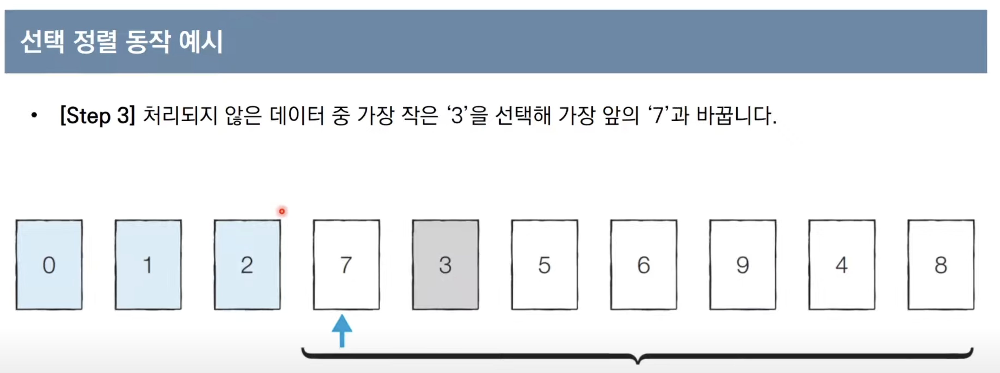
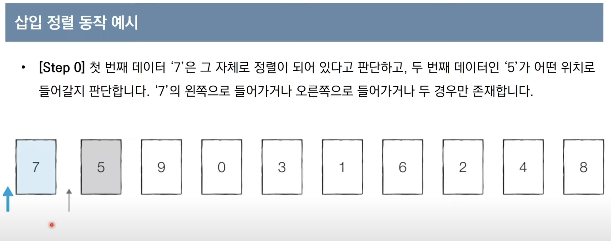
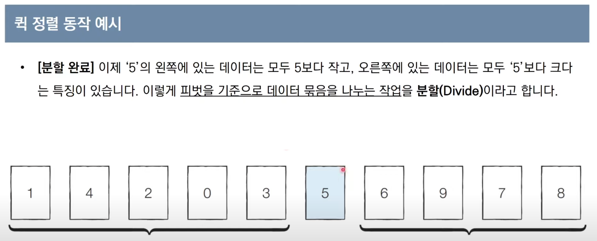
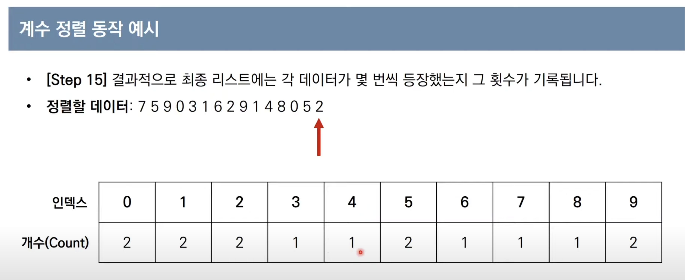

# 정렬 알고리즘

## Selection Sort (선택 정렬)

> O(n**2)

### 동작방식

- *아직 처리되지 않은 데이터* 중에서 가장 작은 데이터를 **선택**해 맨 앞에 있는 데이터와 바꾸는 것을 반복



1. 처음엔 전체 n개중 가장 작은 것을 앞으로 빼오고,
2. n-1, n-2.. 처리되지 않은 데이터 array가 점점 줄어든다

```py
array = [3, 5, 1, 0, 8, 9]

for i in range(len(array)):
    min_index = i
    for j in range(i+1, len(array)):
        if array[min_index] > array[j]:
            min_index = j
        array[min_index], array[j] = array[j], array[min_index]

```


## Insertion Sort (삽입 정렬)

> O(n**2)

### 동작방식

1. 처리되지 않은 데이터를 하나씩 골라 적절한 위치에 삽입합니다.
2. 선택 정렬보다 일반적으로 빠르게 동작합니다.



```py
array = [3, 5, 1, 0, 8, 9]

for i range(1, len(array)):
    for j in range(i, 0, -1):
        if array[j] < array[j-1]:
            array[j], array[j-1] = array[j-1], array[j]
        else:
            break

```


## Quick Sort (퀵 정렬)

> O(NlogN)

### 동작방식

1. **기준 데이터를 설정**하고, 그 **기준보다 큰 데이터와 작은 데이터의 위치를 바꾸는 방법**.
2. 일반적인 상황에서 가장 많이 사용되는 정렬 알고리즘 중 하나
3. **Merge Sort**와 더불어 대부분의 프로그래밍 언어의 정렬 라이브러리의 근간이 되는 알고리즘
4. 가장 기본적인 퀵 정렬은 첫 번째 데이터를 기준 데이터 (***Pivot***)로 설정한다.



```py
array = [3, 5, 1, 0, 8, 9]

def quick_sort(target_array):
    pivot = target_array[0]
    # tail = []
    # head = []

    if len(target_array) <= 1:
        return target_array

    # for i in range(1, len(target_array)):
    #     if target_array[i] > pivot:
    #         tail.append(target_array[i])
    #     else:
    #         head.append(target_array[i])

    tail = target_array[1:] # next target array
    left_side = [x for x in tail if x <= pivot]
    right_side = [x for x in tail if x > pivot]

    return quick_sort(left_side) + [pivot] + quick_sort(right_side)
        
    # return quick_sort(head) + [pivot] + quick_sort(tail)

quick_sort(array)
```


## Counting Sort (계수 정렬)

> O(N + K)

### 동작방식

1. 특정한 조건이 부합할 때만 사용할 수 있지만 매우 빠르게 동작한다
   1. 데이터의 크기 범위가 제한되어 정수 형태로 표현될 수 있을 때 사용
2. 데이터의 개수가 N, 데이터(양수)중 최댓값이 k일 대 최악의 경우에도 수행 시간 O(N + K)를 보장한다



```py
array = [3, 5, 1, 0, 8, 9]

sort_array = [0] * (len(array) + 1)

for idx, value in enumerate(array):
    # value에 해당하는 index값을 카운팅하는 방식
    sort_array[value] += 1

```


